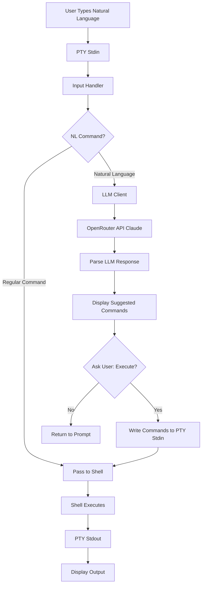

# Natural Language Command Generation
## saternal-core PTY Enhancement

**Status**: Proposal
**Created**: 2025-10-27
**Updated**: 2025-10-27
**Author**: Research & Architecture Document

---

## 1. Overview & Goals

### Feature Description
Add natural language command generation to the saternal terminal that allows users to describe what they want to do in plain English, and the system translates it into executable shell commands using an LLM. Users type natural language prompts, the system sends them to Claude via OpenRouter API, receives generated shell commands, and executes them upon user approval.

### Goals
- **Natural interaction**: Type commands in plain English without memorizing syntax
- **User-controlled**: Requires explicit confirmation before executing any command
- **Transparent**: Shows all generated commands before execution
- **Fast**: Minimal latency, streaming responses where possible
- **Safe**: Never auto-executes commands without user confirmation
- **Context-aware**: Uses current directory, shell state, and environment

### Use Cases
```bash
# File operations
$ list all files modified in the last 24 hours
→ Suggested: find . -type f -mtime -1 -ls
→ Execute? [y/n]: y

# Git workflows
$ show me the commit history for the last week
→ Suggested: git log --since="1 week ago" --oneline
→ Execute? [y/n]: y

# System operations
$ find and kill all node processes
→ Suggested: pkill -9 node
⚠️  WARNING: This command will terminate processes
→ Execute? [y/n]: y

# Complex tasks
$ create a backup of my home directory to an external drive
→ Suggested: rsync -av --progress ~/. /Volumes/Backup/home_backup/
→ Execute? [y/n]: y

# Text processing
$ count how many lines of rust code are in this project
→ Suggested: find . -name "*.rs" -type f -exec wc -l {} + | awk '{s+=$1} END {print s}'
→ Execute? [y/n]: y
```

---

## 2. Architecture Design

### System Components



### Data Flow

1. **Input Detection Phase**
   - User types text and presses Enter
   - System reads current line from terminal grid
   - Heuristic detection: Does it look like natural language vs shell command?
   - Natural language indicators: question words (how, what, when), complete sentences, no common command patterns

2. **LLM Query Phase** (For natural language)
   - Gather context: current directory, shell type, recent commands
   - Build prompt with user's request + context
   - Send to Claude via OpenRouter API
   - Parse response to extract shell command(s)

3. **Command Presentation Phase**
   - Display suggested command(s) with syntax highlighting
   - Show any warnings (destructive operations, sudo required, etc.)
   - Prompt user for confirmation: "Execute? [y/n]"

4. **Execution Phase** (User-confirmed)
   - If yes: Write command to PTY stdin (as if user typed it)
   - Command executes normally in shell
   - Output flows back through PTY stdout
   - If no: Return to prompt, don't execute

---

## 3. Natural Language Detection Strategy

### Heuristic Approach

The system must distinguish between:
- **Shell commands**: `git status`, `ls -la`, `cd /tmp`
- **Natural language**: `list all files`, `show me git status`, `change to tmp directory`

**Detection Criteria:**

```rust
pub struct NLDetector {
    // Words that indicate natural language queries
    question_words: Vec<&'static str>,
    // Common shell commands (if line starts with these, it's likely a command)
    common_commands: Vec<&'static str>,
}

impl NLDetector {
    fn is_natural_language(&self, line: &str) -> bool {
        let line_lower = line.to_lowercase();

        // Check 1: Starts with question word
        if self.question_words.iter().any(|w| line_lower.starts_with(w)) {
            return true;
        }

        // Check 2: Contains question mark
        if line.contains('?') {
            return true;
        }

        // Check 3: Multiple words with articles/conjunctions (natural language patterns)
        let has_articles = ["the", "a", "an", "my", "all", "some"]
            .iter()
            .any(|w| line_lower.contains(w));

        let word_count = line.split_whitespace().count();
        if has_articles && word_count > 3 {
            return true;
        }

        // Check 4: Starts with known shell command = not natural language
        let first_word = line.split_whitespace().next().unwrap_or("");
        if self.common_commands.contains(&first_word) {
            return false;
        }

        // Default: if more than 5 words, likely natural language
        word_count > 5
    }
}

const QUESTION_WORDS: &[&str] = &[
    "how", "what", "when", "where", "why", "who",
    "show", "list", "find", "search", "get", "display",
    "tell", "explain", "help", "can you",
];

const COMMON_COMMANDS: &[&str] = &[
    "ls", "cd", "pwd", "cat", "echo", "grep", "find", "git",
    "npm", "cargo", "python", "node", "curl", "wget", "ssh",
    "mkdir", "rm", "cp", "mv", "touch", "vim", "nano",
];
```

### Alternative: Explicit Trigger

Instead of automatic detection, use an explicit prefix:

```bash
$ nl: list all files modified today
# or
$ ? list all files modified today
# or
$ ask: show me git status
```

This removes ambiguity and gives users explicit control.

---

## 4. User Interaction Flow

### Flow Diagram

```
┌─────────────────────────────────────────┐
│  User enters natural language:          │
│  $ show me all running processes        │
└─────────────┬───────────────────────────┘
              │
              ▼
┌─────────────────────────────────────────┐
│  NL Detector identifies natural language│
└─────────────┬───────────────────────────┘
              │
              ▼
┌─────────────────────────────────────────┐
│  Display to user:                       │
│  🤖 Generating command with Claude...   │
└─────────────┬───────────────────────────┘
              │
              ▼
┌─────────────────────────────────────────┐
│  LLM Response received:                 │
│  Suggested command:                     │
│  $ ps aux | less                        │
└──────────┬──────────────────────────────┘
           │
           ▼
┌─────────────────────────────────────────┐
│  Execute suggested command? [y/n]:      │
└──────────┬──────────────────────────────┘
           │
     ┌─────┴─────┐
     │           │
    No          Yes
     │           │
     ▼           ▼
  [Exit]   ┌─────────────────┐
           │  Write to PTY:  │
           │  ps aux | less  │
           └────────┬─────────┘
                    │
                    ▼
           ┌─────────────────┐
           │  Shell executes │
           │  Output shown   │
           └─────────────────┘
```

### Terminal UI Messages

**Processing:**
```
╭─────────────────────────────────────────────╮
│  🤖 Generating command with Claude...       │
╰─────────────────────────────────────────────╯
```

**Suggestion Display:**
```
╭─────────────────────────────────────────────╮
│  💡 Suggested command:                      │
│                                             │
│  $ find . -type f -mtime -1 -ls            │
│                                             │
│  Execute this command? [y/n]                │
╰─────────────────────────────────────────────╯
```

**Multi-Command Suggestions:**
```
╭─────────────────────────────────────────────╮
│  💡 Suggested commands:                     │
│                                             │
│  1. git add .                               │
│  2. git commit -m "Update files"            │
│  3. git push                                │
│                                             │
│  Execute all? [y/n/c]                       │
│  (c = choose which to run)                  │
╰─────────────────────────────────────────────╯
```

**Warning for Dangerous Commands:**
```
╭─────────────────────────────────────────────╮
│  ⚠️  WARNING: Potentially destructive!      │
│                                             │
│  $ rm -rf /path/to/directory                │
│                                             │
│  This will permanently delete files.        │
│  Type 'yes' to confirm:                     │
╰─────────────────────────────────────────────╯
```

---

## 5. Implementation Components

### 5.1 Natural Language Detector

**File**: `saternal-core/src/nl_detector.rs`

```rust
/// Detects if user input is natural language vs shell command
pub struct NLDetector {
    question_words: Vec<String>,
    common_commands: Vec<String>,
}

impl NLDetector {
    pub fn new() -> Self {
        Self {
            question_words: vec![
                "how", "what", "when", "where", "why", "who",
                "show", "list", "find", "search", "get", "display",
                "tell", "explain", "help", "can you",
            ].into_iter().map(String::from).collect(),

            common_commands: vec![
                "ls", "cd", "pwd", "cat", "echo", "grep", "find", "git",
                "npm", "cargo", "python", "node", "curl", "wget", "ssh",
                "mkdir", "rm", "cp", "mv", "touch", "vim", "nano",
            ].into_iter().map(String::from).collect(),
        }
    }

    /// Check if input looks like natural language
    pub fn is_natural_language(&self, line: &str) -> bool {
        let line_lower = line.to_lowercase();
        let words: Vec<&str> = line.split_whitespace().collect();

        if words.is_empty() {
            return false;
        }

        // Question mark = natural language
        if line.contains('?') {
            return true;
        }

        // Starts with question word
        if self.question_words.iter().any(|w| line_lower.starts_with(w)) {
            return true;
        }

        // Starts with known command = NOT natural language
        if self.common_commands.contains(&words[0].to_string()) {
            return false;
        }

        // Contains articles + multiple words
        let has_articles = ["the", "a", "an", "my", "all", "some", "every"]
            .iter()
            .any(|w| words.contains(w));

        if has_articles && words.len() > 3 {
            return true;
        }

        // More than 5 words = likely natural language
        words.len() > 5
    }
}

#[cfg(test)]
mod tests {
    use super::*;

    #[test]
    fn test_natural_language_detection() {
        let detector = NLDetector::new();

        // Natural language
        assert!(detector.is_natural_language("show me all files"));
        assert!(detector.is_natural_language("how do I list files?"));
        assert!(detector.is_natural_language("find all rust files in this project"));
        assert!(detector.is_natural_language("what is my current directory"));

        // Shell commands
        assert!(!detector.is_natural_language("ls -la"));
        assert!(!detector.is_natural_language("git status"));
        assert!(!detector.is_natural_language("cd /tmp"));
        assert!(!detector.is_natural_language("grep pattern file.txt"));
    }
}
```

### 5.2 LLM Client Integration

**File**: `saternal-core/src/llm_client.rs`

```rust
use anyhow::{Context, Result};
use serde::{Deserialize, Serialize};

/// LLM client for natural language to command translation
pub struct LLMClient {
    api_key: String,
    base_url: String,
    model: String,
}

#[derive(Debug, Serialize)]
struct LLMRequest {
    model: String,
    messages: Vec<Message>,
    max_tokens: u32,
    temperature: f32,
}

#[derive(Debug, Serialize, Deserialize)]
struct Message {
    role: String,
    content: String,
}

#[derive(Debug, Deserialize)]
struct LLMResponse {
    choices: Vec<Choice>,
}

#[derive(Debug, Deserialize)]
struct Choice {
    message: Message,
}

impl LLMClient {
    /// Create new LLM client (OpenRouter with Claude)
    pub fn new(api_key: String) -> Self {
        Self {
            api_key,
            base_url: "https://openrouter.ai/api/v1/chat/completions".to_string(),
            model: "anthropic/claude-3-5-sonnet".to_string(),
        }
    }

    /// Generate shell command from natural language
    pub async fn generate_command(
        &self,
        natural_language: &str,
        context: &CommandContext,
    ) -> Result<Vec<String>> {
        let prompt = self.build_prompt(natural_language, context);
        let response = self.query_llm(&prompt).await?;
        let commands = self.parse_commands(&response)?;

        Ok(commands)
    }

    fn build_prompt(&self, nl: &str, context: &CommandContext) -> String {
        format!(
            r#"You are a shell command generator. Convert natural language requests into executable shell commands.

CONTEXT:
- Shell: {}
- Current Directory: {}
- OS: {}

USER REQUEST:
{}

INSTRUCTIONS:
1. Generate ONLY valid shell commands for the user's shell
2. Output one command per line
3. No explanations, no markdown, no comments
4. If multiple steps needed, output them in order
5. Prefer safe, non-destructive commands when possible

COMMANDS:"#,
            context.shell,
            context.current_dir,
            context.os,
            nl
        )
    }

    async fn query_llm(&self, prompt: &str) -> Result<String> {
        let client = reqwest::Client::new();

        let request = LLMRequest {
            model: self.model.clone(),
            messages: vec![
                Message {
                    role: "user".to_string(),
                    content: prompt.to_string(),
                }
            ],
            max_tokens: 512,
            temperature: 0.2, // Low for deterministic commands
        };

        let response = client
            .post(&self.base_url)
            .header("Authorization", format!("Bearer {}", self.api_key))
            .header("Content-Type", "application/json")
            .json(&request)
            .send()
            .await
            .context("Failed to send request to LLM")?;

        if !response.status().is_success() {
            let status = response.status();
            let body = response.text().await?;
            anyhow::bail!("LLM request failed with status {}: {}", status, body);
        }

        let llm_response: LLMResponse = response
            .json()
            .await
            .context("Failed to parse LLM response")?;

        Ok(llm_response.choices[0].message.content.clone())
    }

    fn parse_commands(&self, response: &str) -> Result<Vec<String>> {
        let commands: Vec<String> = response
            .lines()
            .map(|line| line.trim())
            .filter(|line| !line.is_empty())
            .filter(|line| !line.starts_with('#'))  // Filter comments
            .filter(|line| !line.starts_with("```")) // Filter markdown
            .map(|line| line.to_string())
            .collect();

        if commands.is_empty() {
            anyhow::bail!("LLM returned no commands");
        }

        Ok(commands)
    }
}

/// Context for command generation
pub struct CommandContext {
    pub shell: String,
    pub current_dir: String,
    pub os: String,
}

impl CommandContext {
    pub fn gather() -> Self {
        Self {
            shell: std::env::var("SHELL")
                .unwrap_or_else(|_| "bash".to_string()),
            current_dir: std::env::current_dir()
                .map(|p| p.to_string_lossy().to_string())
                .unwrap_or_else(|_| "~".to_string()),
            os: std::env::consts::OS.to_string(),
        }
    }
}

#[cfg(test)]
mod tests {
    use super::*;

    #[test]
    fn test_parse_commands() {
        let client = LLMClient::new("test_key".to_string());

        let response = "find . -name '*.rs'\nwc -l";
        let commands = client.parse_commands(response).unwrap();
        assert_eq!(commands.len(), 2);
        assert_eq!(commands[0], "find . -name '*.rs'");
        assert_eq!(commands[1], "wc -l");
    }

    #[test]
    fn test_prompt_building() {
        let client = LLMClient::new("test_key".to_string());
        let context = CommandContext {
            shell: "zsh".to_string(),
            current_dir: "/Users/sam/project".to_string(),
            os: "macos".to_string(),
        };

        let prompt = client.build_prompt("list all files", &context);
        assert!(prompt.contains("zsh"));
        assert!(prompt.contains("/Users/sam/project"));
        assert!(prompt.contains("list all files"));
    }
}
```

### 5.3 Integration into Commands Module

**File**: `saternal/src/app/commands.rs` (modifications)

```rust
use saternal_core::llm_client::{LLMClient, CommandContext};
use saternal_core::nl_detector::NLDetector;

/// Extended command type to include NL-generated commands
#[derive(Debug, Clone, PartialEq)]
pub enum TerminalCommand {
    // Existing commands
    Wallpaper { path: Option<String> },
    WallpaperOpacity { opacity: f32 },
    BackgroundOpacity { opacity: f32 },
    BlurStrength { strength: f32 },

    // New: Natural language generated command
    NaturalLanguage {
        original_request: String,
        generated_commands: Vec<String>,
    },
}

/// Parse command - now includes NL detection
pub fn parse_command(
    line: &str,
    nl_detector: &NLDetector,
    llm_client: Option<&LLMClient>,
) -> Option<CommandType> {
    let line = line.trim();

    // First check existing commands (wallpaper, etc.)
    if let Some(cmd) = parse_builtin_command(line) {
        return Some(CommandType::Builtin(cmd));
    }

    // Check if natural language and LLM available
    if nl_detector.is_natural_language(line) && llm_client.is_some() {
        return Some(CommandType::NaturalLanguage(line.to_string()));
    }

    None
}

pub enum CommandType {
    Builtin(TerminalCommand),
    NaturalLanguage(String),
}

fn parse_builtin_command(line: &str) -> Option<TerminalCommand> {
    // Existing wallpaper/opacity parsing logic
    // ... (keep all existing code)
    None
}
```

### 5.4 Input Handler Integration

**File**: `saternal/src/app/input.rs` (modifications)

```rust
// Add to handle_terminal_input function

if bytes == b"\r" || bytes == b"\n" {  // Enter key
    if let Some(line) = read_current_line_from_grid(tab_manager) {
        // Initialize NL detector (or get from app state)
        let nl_detector = NLDetector::new();
        let llm_client = get_llm_client(); // Get from app state

        match parse_command(&line, &nl_detector, llm_client.as_ref()) {
            Some(CommandType::Builtin(cmd)) => {
                // Execute builtin command (existing logic)
                execute_builtin_command(cmd, renderer, window);
                return true;
            }
            Some(CommandType::NaturalLanguage(nl_request)) => {
                // Handle natural language command
                handle_natural_language_command(
                    nl_request,
                    tab_manager,
                    llm_client.as_ref().unwrap(),
                ).await;
                return true;
            }
            None => {
                // Not a command, pass to shell
            }
        }
    }
}

// Pass to terminal
if let Some(active_tab) = tab_manager.lock().active_tab_mut() {
    let _ = active_tab.write_input(&bytes);
}
```

### 5.5 Natural Language Command Handler

**File**: `saternal/src/app/nl_handler.rs` (new)

```rust
use saternal_core::llm_client::{LLMClient, CommandContext};
use crate::tab::TabManager;

/// Handle natural language command request
pub async fn handle_natural_language_command(
    nl_request: String,
    tab_manager: &Arc<Mutex<TabManager>>,
    llm_client: &LLMClient,
) {
    // Step 1: Show processing message
    display_nl_processing_message(tab_manager);

    // Step 2: Generate command
    let context = CommandContext::gather();
    let result = llm_client.generate_command(&nl_request, &context).await;

    match result {
        Ok(commands) => {
            // Step 3: Display suggestions
            display_suggestions(tab_manager, &commands);

            // Step 4: Wait for user confirmation
            // This will be handled by the input handler
            // Store state in tab_manager for pending execution
            let mut tab_mgr = tab_manager.lock();
            if let Some(tab) = tab_mgr.active_tab_mut() {
                tab.pending_nl_commands = Some(commands);
            }
        }
        Err(e) => {
            display_error_message(tab_manager, &format!("Failed to generate command: {}", e));
        }
    }
}

fn display_nl_processing_message(tab_manager: &Arc<Mutex<TabManager>>) {
    // Write styled message to terminal
    let message = "\r\n🤖 Generating command with Claude...\r\n";
    let mut tab_mgr = tab_manager.lock();
    if let Some(tab) = tab_mgr.active_tab_mut() {
        let _ = tab.write_input(message.as_bytes());
    }
}

fn display_suggestions(tab_manager: &Arc<Mutex<TabManager>>, commands: &[String]) {
    let mut message = String::from("\r\n💡 Suggested command(s):\r\n");

    for (i, cmd) in commands.iter().enumerate() {
        message.push_str(&format!("  {}. {}\r\n", i + 1, cmd));
    }

    message.push_str("\r\nExecute? [y/n]: ");

    let mut tab_mgr = tab_manager.lock();
    if let Some(tab) = tab_mgr.active_tab_mut() {
        let _ = tab.write_input(message.as_bytes());
    }
}

fn display_error_message(tab_manager: &Arc<Mutex<TabManager>>, error: &str) {
    let message = format!("\r\n❌ {}\r\n", error);
    let mut tab_mgr = tab_manager.lock();
    if let Some(tab) = tab_mgr.active_tab_mut() {
        let _ = tab.write_input(message.as_bytes());
    }
}
```

---

## 6. Safety & Security

### Dangerous Command Detection

```rust
const DANGEROUS_PATTERNS: &[&str] = &[
    "rm -rf /",
    "rm -rf /*",
    "dd if=",
    "mkfs",
    "fdisk",
    "> /dev/sd",
    "chmod -R 777",
    "kill -9 -1",
    ":(){ :|:& };:", // Fork bomb
];

pub fn is_dangerous_command(cmd: &str) -> bool {
    DANGEROUS_PATTERNS.iter().any(|pattern| cmd.contains(pattern))
}

pub fn requires_sudo(cmd: &str) -> bool {
    cmd.trim_start().starts_with("sudo ")
}
```

### User Confirmation Levels

```rust
pub enum ConfirmationLevel {
    Standard,   // Simple [y/n]
    Elevated,   // Type 'yes' to confirm
    Sudo,       // Warn about privileged access
}

impl ConfirmationLevel {
    pub fn for_command(cmd: &str) -> Self {
        if is_dangerous_command(cmd) {
            Self::Elevated
        } else if requires_sudo(cmd) {
            Self::Sudo
        } else {
            Self::Standard
        }
    }
}
```

---

## 7. Code Structure & Files

### New Files

```
saternal-core/src/
├── nl_detector.rs       # Natural language detection (NEW)
├── llm_client.rs        # LLM integration (NEW)
└── lib.rs               # Export new modules

saternal/src/app/
├── nl_handler.rs        # NL command handling (NEW)
└── commands.rs          # Extend with NL support (MODIFIED)
```

### Modified Files

```
saternal/src/app/
├── input.rs             # Add NL command handling
└── event_loop.rs        # Handle async LLM calls

saternal/src/
└── tab.rs               # Add pending_nl_commands field
```

### Dependencies to Add

**`saternal-core/Cargo.toml`:**
```toml
[dependencies]
# Existing dependencies...

# New dependencies for NL commands
reqwest = { version = "0.11", features = ["json"] }
serde = { version = "1.0", features = ["derive"] }
serde_json = "1.0"
tokio = { version = "1.35", features = ["full"] }
```

### Configuration

**`~/.config/saternal/config.toml`:**
```toml
[nl_commands]
enabled = true
provider = "openrouter"
model = "anthropic/claude-3-5-sonnet"
# API key from environment: OPENROUTER_API_KEY

# Detection mode: "auto" or "explicit"
# auto: Automatically detect natural language
# explicit: Require prefix like "nl:" or "?"
detection_mode = "auto"

# Confirmation required
require_confirmation = true
```

---

## 8. Implementation Timeline

### Phase 1: Core Infrastructure (Week 1)
- [ ] Implement `NLDetector` module
- [ ] Implement `LLMClient` module with OpenRouter integration
- [ ] Add unit tests for both modules
- [ ] Add configuration loading
- [ ] **Milestone**: Can detect NL and query LLM

### Phase 2: Terminal Integration (Week 1-2)
- [ ] Modify `commands.rs` to support NL commands
- [ ] Integrate into `input.rs` Enter key handler
- [ ] Implement `nl_handler.rs` for async processing
- [ ] Add UI messages for processing/suggestions
- [ ] **Milestone**: End-to-end NL → LLM → Display works

### Phase 3: Command Execution (Week 2)
- [ ] Implement confirmation prompt handling
- [ ] Write confirmed commands to PTY stdin
- [ ] Handle multi-command execution
- [ ] Add proper error handling
- [ ] **Milestone**: Commands execute in shell

### Phase 4: Safety & Polish (Week 3)
- [ ] Add dangerous command detection
- [ ] Implement elevated confirmation prompts
- [ ] Add command preview with syntax highlighting
- [ ] Performance optimization
- [ ] **Milestone**: Production-ready feature

### Phase 5: Advanced Features (Future)
- [ ] Command history context
- [ ] Multi-step command planning
- [ ] Learning from user corrections
- [ ] Streaming LLM responses
- [ ] Local model support (Ollama)

---

## 9. Example Workflows

### Scenario 1: File Search

```bash
$ find all python files modified this week

🤖 Generating command with Claude...

💡 Suggested command:
  find . -name "*.py" -type f -mtime -7

Execute? [y/n]: y

./src/main.py
./tests/test_utils.py
./scripts/deploy.py
```

### Scenario 2: Git Operations

```bash
$ create a new branch called feature-auth and switch to it

🤖 Generating command with Claude...

💡 Suggested commands:
  1. git checkout -b feature-auth

Execute? [y/n]: y

Switched to a new branch 'feature-auth'
```

### Scenario 3: System Monitoring

```bash
$ show me processes using more than 1GB of memory

🤖 Generating command with Claude...

💡 Suggested command:
  ps aux | awk '$6 > 1000000 {print $0}'

Execute? [y/n]: y

USER    PID  %CPU %MEM      VSZ    RSS   TT  STAT STARTED      TIME COMMAND
sam     1234  5.2  8.1  2048000 1100000 ??  S    Mon  12:00  25:00.00 node
```

### Scenario 4: Dangerous Command Warning

```bash
$ delete all node_modules folders recursively

🤖 Generating command with Claude...

💡 Suggested command:
  find . -name "node_modules" -type d -exec rm -rf {} +

⚠️  WARNING: This command will permanently delete directories
Type 'yes' to confirm: yes

Executing...
[Deletes node_modules folders]
```

---

## 10. Success Metrics

### Technical Metrics
- Natural language detection accuracy: >90%
- False positive rate: <5%
- LLM response time: <3 seconds (p95)
- Command acceptance rate: >70% (users say yes)

### User Experience Metrics
- Time saved vs manual command lookup: >60%
- User satisfaction score: >4/5
- Feature usage frequency: >10 commands/day per active user

### Safety Metrics
- Zero unintended dangerous command executions
- 100% confirmation before execution
- Dangerous command warnings: 100% accuracy

---

## 11. Future Enhancements

### Short Term
1. **Streaming responses**: Show command as LLM generates it
2. **Command explanation**: Optional explanation mode
3. **Multi-step workflows**: Chain multiple related commands
4. **Command history learning**: Learn from accepted/rejected suggestions

### Medium Term
1. **Local model support**: Add Ollama integration for offline use
2. **Shell-specific optimization**: Detect shell (bash/zsh/fish) and optimize
3. **Context awareness**: Include recent commands, git status, etc.
4. **Interactive refinement**: "Modify the last suggestion to..."

### Long Term
1. **Agentic workflows**: Multi-step planning with intermediate execution
2. **Natural language output parsing**: Translate command output to NL
3. **Command templates**: Save common NL→command mappings
4. **Collaborative learning**: Anonymous suggestion database (opt-in)

---

## 12. Alternative Approaches

### Approach 1: Explicit Trigger Prefix

Instead of auto-detection, require explicit prefix:

```bash
$ nl: show me all files
# or
$ ? show me all files
```

**Pros**: No ambiguity, clear intent, no false positives
**Cons**: Extra typing, breaks natural flow

### Approach 2: Modal System

Add a "natural language mode" that users enter explicitly:

```bash
$ nl-mode
Entering natural language mode. Type 'exit' to return.
nl> show me all files
Suggested: ls -la
Execute? [y/n]: y
nl> exit
$
```

**Pros**: Very clear separation, no detection needed
**Cons**: Clunky UX, extra mode to manage

### Approach 3: Post-Command Analysis

Let users run regular commands, but offer to explain/improve them:

```bash
$ ls -la
[output]
$ explain
🤖 The command 'ls -la' lists all files (-a) in long format (-l)
$ suggest better
💡 Alternative: exa -la (modern ls replacement with colors)
```

**Pros**: Learn as you go, non-intrusive
**Cons**: Different use case, doesn't help with command generation

---

## Appendix A: Configuration Options

```toml
[nl_commands]
# Enable/disable natural language commands
enabled = true

# LLM provider (openrouter, anthropic, openai)
provider = "openrouter"

# Model to use
model = "anthropic/claude-3-5-sonnet"

# API key (or use OPENROUTER_API_KEY env var)
# api_key = "sk-..."

# Detection mode: "auto" or "explicit" (prefix required)
detection_mode = "auto"

# Explicit trigger prefix (if detection_mode = "explicit")
trigger_prefix = "nl:"

# Maximum time to wait for LLM response (seconds)
timeout = 10

# Always require confirmation before execution
require_confirmation = true

# Show dangerous command warnings
warn_dangerous = true

# Include context in prompts
include_context = true

# Context to include
[nl_commands.context]
current_directory = true
shell_type = true
os_info = true
recent_commands = false  # Future: include last N commands
git_status = false       # Future: include git repo info
```

## Appendix B: Testing Strategy

### Unit Tests
- Natural language detection accuracy
- LLM response parsing
- Command safety detection
- Context gathering

### Integration Tests
- Full flow with mock LLM
- PTY stdin/stdout interaction
- Error handling

### End-to-End Tests
- Live LLM integration (with test API key)
- Real shell command execution
- User interaction simulation

---

**End of Proposal**

**Status**: Ready for review and implementation
**Next Step**: Phase 1 - Core infrastructure implementation
