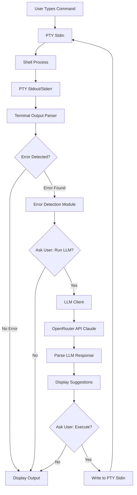

# LLM-Assisted Command Correction Proposal
## saternal-core PTY Enhancement

**Status**: Proposal
**Created**: 2025-10-27
**Author**: Research & Architecture Document

---

## 1. Overview & Goals

### Feature Description
Add intelligent command correction to the saternal-core PTY shell that detects failed commands and offers LLM-powered suggestions to users. When a command fails, the system prompts the user to send it through an LLM for analysis, receives corrected command suggestions, and executes them upon user approval.

### Goals
- **Non-intrusive**: Only activates when commands fail
- **User-controlled**: Requires explicit opt-in for both LLM query and command execution
- **Transparent**: Shows all suggested commands before execution
- **Fast**: Minimal latency impact on normal terminal operations
- **Safe**: Never auto-executes commands without user confirmation

### Use Cases
```bash
# Typo in command
$ gti status
command not found: gti
→ Run through LLM? [y/n]: y
→ Suggested: git status
→ Execute? [y/n]: y

# Missing permissions
$ ./script.sh
Permission denied
→ Run through LLM? [y/n]: y
→ Suggested: chmod +x ./script.sh && ./script.sh
→ Execute? [y/n]: y

# Wrong flag syntax
$ grep --recusive "pattern" file.txt
grep: unrecognized option '--recusive'
→ Run through LLM? [y/n]: y
→ Suggested: grep --recursive "pattern" file.txt
→ Execute? [y/n]: y
```

---

## 2. Architecture Design

### System Components



### Data Flow

1. **Command Execution Phase**
   - User types command → PTY stdin
   - Terminal tracks command in buffer
   - Shell executes → Output to PTY stdout/stderr

2. **Error Detection Phase** (Hybrid Approach)
   - **Pattern Matching**: Parse stdout/stderr for error patterns
   - **Exit Code Monitoring**: Track shell process exit codes (non-zero = potential failure)
   - Combine both methods for accuracy

3. **LLM Query Phase** (User-initiated)
   - Prompt user: "Command failed. Run through LLM? [y/n]"
   - If yes: Send failed command + error output to LLM
   - LLM analyzes and returns corrected command(s)

4. **Execution Phase** (User-confirmed)
   - Display suggested command(s) to user
   - Prompt: "Execute suggested command? [y/n]"
   - If yes: Write command to PTY stdin
   - Command executes normally in shell

---

## 3. Error Detection Strategy

### Hybrid Detection Approach

#### Method 1: Pattern Matching (Immediate)
Fast detection by parsing PTY output for known error patterns.

**Common Shell Error Patterns:**
```rust
const ERROR_PATTERNS: &[&str] = &[
    // Command not found
    "command not found",
    "not found",
    "No such file or directory",

    // Permission errors
    "Permission denied",
    "permission denied",
    "Operation not permitted",

    // Syntax errors
    "syntax error",
    "unexpected token",
    "unrecognized option",
    "invalid option",

    // Path/file errors
    "cannot access",
    "does not exist",
    "No such command",

    // Python/Ruby/Node specific
    "ModuleNotFoundError",
    "SyntaxError:",
    "Error:",
    "ENOENT",
];
```

**Shell-Specific Patterns:**
```rust
// bash/zsh
r"bash: .+: command not found"
r"zsh: command not found: .+"

// Fish
r"fish: Unknown command"

// Generic
r": not found$"
r"^.*: No such file or directory$"
```

#### Method 2: Exit Code Monitoring (Reliable)
Track command execution status through shell exit codes.

**Exit Code Semantics:**
- `0` - Success (no error)
- `1` - General errors
- `2` - Misuse of shell command
- `126` - Command cannot execute (permission)
- `127` - Command not found
- `128+N` - Fatal error signal N

**Implementation Strategy:**
```rust
struct CommandExecution {
    command: String,
    output: Vec<String>,  // Lines of stdout/stderr
    exit_code: Option<i32>,
    error_detected: bool,
}

impl CommandExecution {
    fn has_error(&self) -> bool {
        // Hybrid check
        self.exit_code.map_or(false, |code| code != 0)
            || self.output_contains_error_pattern()
    }
}
```

### Detection Timing

**Challenge**: Shell output is asynchronous and may not include exit codes directly.

**Solutions:**
1. **Prompt Detection**: Monitor for shell prompt return (PS1)
   - When prompt appears, last command completed
   - Check buffered output for errors

2. **Timeout-Based**: Set reasonable timeout (500ms)
   - After command submission, wait for output to settle
   - Analyze accumulated output for error patterns

3. **Exit Code Injection** (Advanced):
   - Modify shell config to include exit code in prompt
   - Parse: `[EXIT:127]` markers from output

---

## 4. User Interaction Flow

### Flow Diagram

```
┌─────────────────────────────────────────┐
│  User enters command:                   │
│  $ gti status                           │
└─────────────┬───────────────────────────┘
              │
              ▼
┌─────────────────────────────────────────┐
│  Shell executes → Error output:         │
│  zsh: command not found: gti            │
└─────────────┬───────────────────────────┘
              │
              ▼
┌─────────────────────────────────────────┐
│  Error Detector identifies failure      │
│  Pattern: "command not found"           │
└─────────────┬───────────────────────────┘
              │
              ▼
┌─────────────────────────────────────────┐
│  Display to user:                       │
│  → Command failed. Run through LLM?     │
│     [y/n]:                              │
└─────────────┬───────────────────────────┘
              │
        ┌─────┴─────┐
        │           │
       No          Yes
        │           │
        ▼           ▼
     [Exit]   ┌─────────────────────────────┐
              │  Sending to LLM...          │
              │  (Show loading indicator)   │
              └──────────┬──────────────────┘
                         │
                         ▼
              ┌─────────────────────────────┐
              │  LLM Response received:     │
              │  Suggested command:         │
              │  $ git status               │
              └──────────┬──────────────────┘
                         │
                         ▼
              ┌─────────────────────────────┐
              │  Execute suggested command? │
              │  [y/n]:                     │
              └──────────┬──────────────────┘
                         │
                   ┌─────┴─────┐
                   │           │
                  No          Yes
                   │           │
                   ▼           ▼
                [Exit]   ┌─────────────────┐
                         │  Execute: git   │
                         │  status         │
                         └─────────────────┘
```

### Terminal UI Messages

**Error Detected:**
```
zsh: command not found: gti
╭─────────────────────────────────────────────╮
│  ⚠ Command failed                          │
│  Run through LLM for suggestions? (y/n)    │
╰─────────────────────────────────────────────╯
```

**LLM Processing:**
```
╭─────────────────────────────────────────────╮
│  🤖 Analyzing command with Claude...       │
╰─────────────────────────────────────────────╯
```

**Suggestion Display:**
```
╭─────────────────────────────────────────────╮
│  💡 Suggested correction:                  │
│                                            │
│  $ git status                              │
│                                            │
│  Execute this command? (y/n)               │
╰─────────────────────────────────────────────╯
```

**Multi-Command Suggestions:**
```
╭─────────────────────────────────────────────╮
│  💡 Suggested corrections:                 │
│                                            │
│  1. chmod +x ./script.sh                   │
│  2. ./script.sh                            │
│                                            │
│  Execute all? (y/n)                        │
╰─────────────────────────────────────────────╯
```

---

## 5. Implementation Components

### 5.1 Error Detection Module

**File**: `saternal-core/src/command_error.rs`

```rust
use regex::Regex;
use lazy_static::lazy_static;

/// Error detection result
#[derive(Debug, Clone)]
pub struct CommandError {
    pub command: String,
    pub error_output: String,
    pub error_type: ErrorType,
    pub exit_code: Option<i32>,
}

#[derive(Debug, Clone, PartialEq)]
pub enum ErrorType {
    CommandNotFound,
    PermissionDenied,
    SyntaxError,
    FileNotFound,
    InvalidOption,
    Generic,
}

lazy_static! {
    static ref ERROR_PATTERNS: Vec<(Regex, ErrorType)> = vec![
        (Regex::new(r"command not found|not found").unwrap(), ErrorType::CommandNotFound),
        (Regex::new(r"[Pp]ermission denied|Operation not permitted").unwrap(), ErrorType::PermissionDenied),
        (Regex::new(r"syntax error|unexpected token").unwrap(), ErrorType::SyntaxError),
        (Regex::new(r"No such file or directory|does not exist").unwrap(), ErrorType::FileNotFound),
        (Regex::new(r"unrecognized option|invalid option").unwrap(), ErrorType::InvalidOption),
    ];
}

pub struct ErrorDetector {
    output_buffer: Vec<String>,
    last_command: Option<String>,
}

impl ErrorDetector {
    pub fn new() -> Self {
        Self {
            output_buffer: Vec::new(),
            last_command: None,
        }
    }

    /// Add output line to buffer for analysis
    pub fn add_output(&mut self, line: &str) {
        self.output_buffer.push(line.to_string());

        // Keep buffer size reasonable (last 50 lines)
        if self.output_buffer.len() > 50 {
            self.output_buffer.remove(0);
        }
    }

    /// Track the command being executed
    pub fn set_command(&mut self, command: String) {
        self.last_command = Some(command);
        self.output_buffer.clear();
    }

    /// Check if recent output indicates an error
    pub fn detect_error(&self) -> Option<CommandError> {
        let recent_output = self.output_buffer.join("\n");

        // Pattern matching
        for (pattern, error_type) in ERROR_PATTERNS.iter() {
            if pattern.is_match(&recent_output) {
                return Some(CommandError {
                    command: self.last_command.clone().unwrap_or_default(),
                    error_output: recent_output.clone(),
                    error_type: error_type.clone(),
                    exit_code: None,
                });
            }
        }

        None
    }

    /// Check error with exit code (hybrid approach)
    pub fn check_with_exit_code(&self, exit_code: i32) -> Option<CommandError> {
        // Non-zero exit code = error
        if exit_code != 0 {
            let error_type = match exit_code {
                127 => ErrorType::CommandNotFound,
                126 => ErrorType::PermissionDenied,
                2 => ErrorType::SyntaxError,
                _ => ErrorType::Generic,
            };

            return Some(CommandError {
                command: self.last_command.clone().unwrap_or_default(),
                error_output: self.output_buffer.join("\n"),
                error_type,
                exit_code: Some(exit_code),
            });
        }

        // Even with exit code 0, check patterns (some tools don't exit properly)
        self.detect_error()
    }

    /// Clear state after processing
    pub fn clear(&mut self) {
        self.output_buffer.clear();
        self.last_command = None;
    }
}

#[cfg(test)]
mod tests {
    use super::*;

    #[test]
    fn test_command_not_found() {
        let mut detector = ErrorDetector::new();
        detector.set_command("gti status".to_string());
        detector.add_output("zsh: command not found: gti");

        let error = detector.detect_error();
        assert!(error.is_some());
        assert_eq!(error.unwrap().error_type, ErrorType::CommandNotFound);
    }

    #[test]
    fn test_permission_denied() {
        let mut detector = ErrorDetector::new();
        detector.set_command("./script.sh".to_string());
        detector.add_output("bash: ./script.sh: Permission denied");

        let error = detector.detect_error();
        assert!(error.is_some());
        assert_eq!(error.unwrap().error_type, ErrorType::PermissionDenied);
    }
}
```

### 5.2 LLM Client Integration

**File**: `saternal-core/src/llm_client.rs`

```rust
use anyhow::{Context, Result};
use serde::{Deserialize, Serialize};

/// LLM client for command correction
pub struct LLMClient {
    api_key: String,
    base_url: String,
    model: String,
}

#[derive(Debug, Serialize)]
struct LLMRequest {
    model: String,
    messages: Vec<Message>,
    max_tokens: u32,
    temperature: f32,
}

#[derive(Debug, Serialize, Deserialize)]
struct Message {
    role: String,
    content: String,
}

#[derive(Debug, Deserialize)]
struct LLMResponse {
    choices: Vec<Choice>,
}

#[derive(Debug, Deserialize)]
struct Choice {
    message: Message,
}

impl LLMClient {
    /// Create new LLM client (OpenRouter with Claude default)
    pub fn new(api_key: String) -> Self {
        Self {
            api_key,
            base_url: "https://openrouter.ai/api/v1/chat/completions".to_string(),
            model: "anthropic/claude-3-5-sonnet".to_string(),
        }
    }

    /// Get command suggestions from LLM
    pub async fn get_command_suggestions(
        &self,
        failed_command: &str,
        error_output: &str,
    ) -> Result<Vec<String>> {
        let prompt = self.build_prompt(failed_command, error_output);
        let response = self.query_llm(&prompt).await?;
        let commands = self.parse_commands(&response)?;

        Ok(commands)
    }

    fn build_prompt(&self, command: &str, error: &str) -> String {
        format!(
            r#"A shell command failed with an error. Analyze it and provide a corrected command.

FAILED COMMAND:
{}

ERROR OUTPUT:
{}

Please respond with ONLY the corrected shell command(s), one per line.
Do not include explanations or markdown formatting.
If multiple commands are needed (e.g., chmod then execute), list them in order.

CORRECTED COMMAND(S):"#,
            command, error
        )
    }

    async fn query_llm(&self, prompt: &str) -> Result<String> {
        let client = reqwest::Client::new();

        let request = LLMRequest {
            model: self.model.clone(),
            messages: vec![
                Message {
                    role: "user".to_string(),
                    content: prompt.to_string(),
                }
            ],
            max_tokens: 256,
            temperature: 0.1, // Low temperature for deterministic corrections
        };

        let response = client
            .post(&self.base_url)
            .header("Authorization", format!("Bearer {}", self.api_key))
            .header("Content-Type", "application/json")
            .json(&request)
            .send()
            .await
            .context("Failed to send request to LLM")?;

        if !response.status().is_success() {
            let status = response.status();
            let body = response.text().await?;
            anyhow::bail!("LLM request failed with status {}: {}", status, body);
        }

        let llm_response: LLMResponse = response
            .json()
            .await
            .context("Failed to parse LLM response")?;

        Ok(llm_response.choices[0].message.content.clone())
    }

    fn parse_commands(&self, response: &str) -> Result<Vec<String>> {
        let commands: Vec<String> = response
            .lines()
            .map(|line| line.trim())
            .filter(|line| !line.is_empty())
            .filter(|line| !line.starts_with('#')) // Filter comments
            .map(|line| line.to_string())
            .collect();

        if commands.is_empty() {
            anyhow::bail!("LLM returned no commands");
        }

        Ok(commands)
    }
}

#[cfg(test)]
mod tests {
    use super::*;

    #[test]
    fn test_parse_commands() {
        let client = LLMClient::new("test_key".to_string());

        let response = "git status\n";
        let commands = client.parse_commands(response).unwrap();
        assert_eq!(commands, vec!["git status"]);

        let response = "chmod +x script.sh\n./script.sh\n";
        let commands = client.parse_commands(response).unwrap();
        assert_eq!(commands, vec!["chmod +x script.sh", "./script.sh"]);
    }

    #[test]
    fn test_prompt_building() {
        let client = LLMClient::new("test_key".to_string());
        let prompt = client.build_prompt("gti status", "command not found: gti");

        assert!(prompt.contains("gti status"));
        assert!(prompt.contains("command not found"));
    }
}
```

### 5.3 Terminal Integration

**File**: `saternal-core/src/terminal.rs` (modifications)

```rust
use crate::command_error::{ErrorDetector, CommandError};
use crate::llm_client::LLMClient;

pub struct Terminal {
    term: Arc<Mutex<Term<TermEventListener>>>,
    pty: tty::Pty,
    processor: Processor,

    // New fields for command correction
    error_detector: ErrorDetector,
    llm_client: Option<LLMClient>,
    command_buffer: String,
    awaiting_user_response: bool,
}

impl Terminal {
    pub fn new(cols: usize, rows: usize, shell: Option<String>) -> Result<Self> {
        // ... existing initialization ...

        // Initialize error detector
        let error_detector = ErrorDetector::new();

        // Initialize LLM client if API key available
        let llm_client = std::env::var("OPENROUTER_API_KEY")
            .ok()
            .map(|key| LLMClient::new(key));

        Ok(Self {
            term,
            pty,
            processor,
            error_detector,
            llm_client,
            command_buffer: String::new(),
            awaiting_user_response: false,
        })
    }

    /// Write input to terminal (modified to track commands)
    pub fn write_input(&mut self, data: &[u8]) -> Result<()> {
        use std::io::Write;

        // Track command input
        if let Ok(text) = std::str::from_utf8(data) {
            if text.contains('\n') || text.contains('\r') {
                // Command submitted
                let command = self.command_buffer.clone();
                self.error_detector.set_command(command);
                self.command_buffer.clear();
            } else {
                self.command_buffer.push_str(text);
            }
        }

        self.pty.writer().write_all(data)?;
        Ok(())
    }

    /// Process output (modified to detect errors)
    pub fn process_output(&mut self) -> Result<usize> {
        use std::io::Read;

        let mut buf = [0u8; 4096];
        let mut total_bytes = 0;

        loop {
            match self.pty.reader().read(&mut buf) {
                Ok(0) => break,
                Ok(n) => {
                    total_bytes += n;
                    let output = String::from_utf8_lossy(&buf[..n]);

                    // Feed to error detector
                    for line in output.lines() {
                        self.error_detector.add_output(line);
                    }

                    // Process through terminal
                    let mut term = self.term.lock();
                    self.processor.advance(&mut *term, &buf[..n]);
                }
                Err(e) if e.kind() == std::io::ErrorKind::WouldBlock => break,
                Err(e) => return Err(e.into()),
            }
        }

        // Check for errors after output settles
        if total_bytes > 0 {
            if let Some(error) = self.error_detector.detect_error() {
                self.handle_command_error(error)?;
            }
        }

        Ok(total_bytes)
    }

    /// Handle detected command error
    fn handle_command_error(&mut self, error: CommandError) -> Result<()> {
        if self.llm_client.is_none() {
            return Ok(()); // LLM not configured
        }

        // Display prompt to user: "Run through LLM? [y/n]"
        // This would be implemented in the UI layer
        self.awaiting_user_response = true;

        // Store error for later processing
        // (Actual implementation would involve callback to UI)

        Ok(())
    }

    /// User confirmed to run LLM
    pub async fn run_llm_correction(&mut self, error: CommandError) -> Result<Vec<String>> {
        let client = self.llm_client.as_ref()
            .context("LLM client not configured")?;

        let suggestions = client
            .get_command_suggestions(&error.command, &error.error_output)
            .await?;

        Ok(suggestions)
    }

    /// Execute suggested command
    pub fn execute_suggestion(&mut self, command: &str) -> Result<()> {
        let command_with_newline = format!("{}\n", command);
        self.write_input(command_with_newline.as_bytes())?;
        Ok(())
    }
}
```

---

## 6. Code Structure & Files

### New Files

```
saternal-core/src/
├── command_error.rs      # Error detection module (NEW)
├── llm_client.rs         # LLM integration (NEW)
└── lib.rs                # Export new modules
```

### Modified Files

```
saternal-core/src/
├── terminal.rs           # Add error detection hooks
└── lib.rs                # Re-export new types

saternal/src/
└── app.rs                # Add UI for prompts and suggestions
```

### Dependencies to Add

**`saternal-core/Cargo.toml`:**
```toml
[dependencies]
# Existing dependencies...

# New dependencies for LLM correction
regex = "1.10"
lazy_static = "1.4"
reqwest = { version = "0.11", features = ["json"] }
serde = { version = "1.0", features = ["derive"] }
serde_json = "1.0"
tokio = { version = "1.35", features = ["full"] }
```

### Configuration

**`~/.config/saternal/config.toml`:**
```toml
[llm]
enabled = true
provider = "openrouter"
model = "anthropic/claude-3-5-sonnet"
# API key should be in environment variable: OPENROUTER_API_KEY
```

---

## 7. Error Detection Patterns

### Shell-Specific Error Messages

#### Bash
```
bash: command: command not found
bash: ./script: Permission denied
bash: syntax error near unexpected token `newline'
```

#### Zsh
```
zsh: command not found: command
zsh: permission denied: ./script
zsh: parse error near `\n'
```

#### Fish
```
fish: Unknown command: command
fish: The file './script' is not executable by this user
```

### Exit Code Reference

| Code | Meaning | Common Cause |
|------|---------|--------------|
| 0 | Success | Command completed |
| 1 | General error | Various failures |
| 2 | Misuse | Wrong syntax/arguments |
| 126 | Cannot execute | Permission denied |
| 127 | Not found | Command doesn't exist |
| 128+N | Fatal signal | Killed by signal N |
| 130 | Ctrl+C | User interrupted |

### Detection Confidence Levels

```rust
pub enum ConfidenceLevel {
    High,      // Exit code 127 + "command not found" pattern
    Medium,    // Either exit code OR pattern matches
    Low,       // Heuristic match (generic error keywords)
}
```

Only trigger LLM for High and Medium confidence errors to avoid false positives.

---

## 8. LLM Integration Details

### API Request Structure

**OpenRouter API (Compatible with OpenAI format):**
```json
{
  "model": "anthropic/claude-3-5-sonnet",
  "messages": [
    {
      "role": "user",
      "content": "A shell command failed...\n\nFAILED COMMAND:\ngti status\n\nERROR OUTPUT:\ncommand not found: gti\n\nPlease respond with ONLY the corrected shell command(s)..."
    }
  ],
  "max_tokens": 256,
  "temperature": 0.1
}
```

### Prompt Engineering

**System Prompt Strategy:**
```
You are a shell command correction assistant. When given a failed command and its error output, provide only the corrected command(s) needed to fix the issue.

Rules:
1. Output ONLY valid shell commands, one per line
2. No explanations, markdown, or commentary
3. If multiple steps needed, list them in execution order
4. Preserve the user's intent while fixing syntax/typos
5. Consider the shell environment (bash/zsh/fish)
```

**Example Prompts & Responses:**

| Failed Command | Error | LLM Response |
|---------------|-------|--------------|
| `gti status` | command not found: gti | `git status` |
| `./script.sh` | Permission denied | `chmod +x ./script.sh`<br>`./script.sh` |
| `grep --recusive "foo" file.txt` | unrecognized option | `grep --recursive "foo" file.txt` |
| `cd /ect` | No such file | `cd /etc` |
| `python3 scrip.py` | No such file | `python3 script.py` |

### Response Parsing

**Expected format:**
```
command1
command2
```

**Edge cases to handle:**
- LLM adds markdown: Strip ``` code blocks
- LLM adds explanations: Extract only command lines
- LLM suggests interactive commands: Warn user
- LLM response timeout: Show error message

---

## 9. Edge Cases & Considerations

### Safety

**Never Auto-Execute:**
- All commands require explicit user confirmation
- Display full command before execution
- Highlight destructive operations (rm, dd, etc.)

**Dangerous Command Detection:**
```rust
const DANGEROUS_KEYWORDS: &[&str] = &[
    "rm -rf", "dd", "mkfs", "fdisk",
    "shutdown", "reboot", "kill -9",
    "chmod 777", "> /dev/sda",
];

fn is_dangerous(command: &str) -> bool {
    DANGEROUS_KEYWORDS.iter().any(|kw| command.contains(kw))
}
```

**Warning UI:**
```
╭─────────────────────────────────────────────╮
│  ⚠️  WARNING: Potentially destructive!     │
│                                            │
│  $ rm -rf /important/data                  │
│                                            │
│  This command may delete files.            │
│  Are you SURE? (type 'yes' to confirm)    │
╰─────────────────────────────────────────────╯
```

### Performance

**Latency Considerations:**
- Error detection: <1ms (pattern matching)
- LLM query: 1-3 seconds (network + inference)
- Use loading indicators during LLM calls
- Cache common corrections locally

**Resource Usage:**
- Minimal memory: Only buffer last command + output
- No background polling: Event-driven only
- Network only when user opts in

### Privacy

**Data Sent to LLM:**
- Failed command string
- Error output (last ~10 lines)
- NO environment variables
- NO command history beyond current failure
- NO file contents or sensitive paths

**User Control:**
```toml
[llm]
enabled = false  # Completely disable feature
```

### Error Handling

**LLM API Failures:**
```rust
match llm_client.get_suggestions().await {
    Ok(suggestions) => display_suggestions(suggestions),
    Err(e) => {
        eprintln!("LLM request failed: {}", e);
        eprintln!("Suggestions unavailable. Try again or fix manually.");
    }
}
```

**Malformed Responses:**
- Validate commands before displaying
- Reject empty responses
- Fallback: "Could not generate suggestions"

### Multi-Line Commands

**Challenge:** User may paste multi-line scripts.

**Solution:** Track command boundaries by shell prompts.

```rust
fn is_shell_prompt(line: &str) -> bool {
    // Common prompt patterns
    line.ends_with("$ ") ||
    line.ends_with("% ") ||
    line.contains("@") && line.ends_with("> ")
}
```

---

## 10. Implementation Timeline

### Phase 1: Core Error Detection (Week 1)
- [ ] Implement `ErrorDetector` module
- [ ] Add pattern matching for common errors
- [ ] Integrate into `Terminal::process_output()`
- [ ] Add unit tests
- [ ] **Milestone**: Terminal detects errors and logs them

### Phase 2: LLM Client Integration (Week 1-2)
- [ ] Implement `LLMClient` module
- [ ] Add OpenRouter API integration
- [ ] Implement prompt engineering
- [ ] Add response parsing
- [ ] Handle API errors gracefully
- [ ] Add integration tests with mock API
- [ ] **Milestone**: Can query LLM and get suggestions

### Phase 3: User Interaction (Week 2)
- [ ] Add UI prompts for "Run LLM?" question
- [ ] Display LLM suggestions in terminal
- [ ] Add "Execute?" confirmation prompt
- [ ] Handle user input (y/n responses)
- [ ] Add loading indicators
- [ ] **Milestone**: Full user flow works end-to-end

### Phase 4: Polish & Safety (Week 3)
- [ ] Add dangerous command detection
- [ ] Implement warning UI
- [ ] Add configuration options
- [ ] Optimize error detection patterns
- [ ] Add local caching for common corrections
- [ ] Comprehensive testing
- [ ] **Milestone**: Production-ready feature

### Phase 5: Advanced Features (Future)
- [ ] Exit code monitoring (requires shell integration)
- [ ] Support for multiple LLM providers
- [ ] Command history context (optional)
- [ ] Analytics on correction accuracy
- [ ] User feedback mechanism

---

## 11. References & Research

### Similar Implementations

#### Shellsage
- **URL**: https://github.com/dheerajcl/Shellsage
- **Approach**: Intercepts terminal errors, uses local/cloud LLMs
- **Architecture**: Python-based, supports Ollama, OpenAI, Anthropic
- **Key Insight**: Hybrid local/cloud model for flexibility

#### Warp Terminal
- **URL**: https://docs.warp.dev/terminal/entry/command-corrections
- **Approach**: Built on "thefuck" open-source project
- **Detection**: Misspelled commands, missing flags, permissions
- **UI**: Inline panel above prompt, accept with click or arrow key
- **Key Insight**: Non-intrusive, enabled by default

#### The Fuck
- **URL**: https://github.com/nvbn/thefuck
- **Approach**: Rule-based command correction
- **Method**: User types `fuck` after error to get correction
- **Key Insight**: Extensive library of correction rules

### Technical Resources

#### Rust PTY Handling
- **Exit code detection**: Challenge with PTY - need shell integration
- **Pattern matching**: Primary reliable method for error detection
- **Buffer management**: Keep last N lines for context

#### LLM Best Practices
- **Low temperature (0.1-0.3)**: Deterministic corrections
- **Short max_tokens (256)**: Fast responses, focused output
- **Clear prompts**: No explanations, just commands
- **Validation**: Parse and validate before execution

### Research Insights

1. **Hybrid detection is essential**: Pattern matching for speed, exit codes for accuracy
2. **User control is critical**: Never auto-execute, always confirm
3. **Privacy matters**: Minimize data sent to LLM
4. **Performance**: Network latency is unavoidable, manage expectations
5. **Safety first**: Detect and warn about dangerous operations

---

## 12. Example Workflows

### Scenario 1: Simple Typo

```bash
$ gti status
zsh: command not found: gti

╭─────────────────────────────────────────────╮
│  ⚠ Command failed                          │
│  Run through LLM for suggestions? (y/n)    │
╰─────────────────────────────────────────────╯
> y

╭─────────────────────────────────────────────╮
│  🤖 Analyzing command with Claude...       │
╰─────────────────────────────────────────────╯

╭─────────────────────────────────────────────╮
│  💡 Suggested correction:                  │
│                                            │
│  $ git status                              │
│                                            │
│  Execute this command? (y/n)               │
╰─────────────────────────────────────────────╯
> y

On branch main
Your branch is up to date with 'origin/main'.
```

### Scenario 2: Permission Error

```bash
$ ./deploy.sh
bash: ./deploy.sh: Permission denied

╭─────────────────────────────────────────────╮
│  ⚠ Command failed                          │
│  Run through LLM for suggestions? (y/n)    │
╰─────────────────────────────────────────────╯
> y

╭─────────────────────────────────────────────╮
│  🤖 Analyzing command with Claude...       │
╰─────────────────────────────────────────────╯

╭─────────────────────────────────────────────╮
│  💡 Suggested corrections:                 │
│                                            │
│  1. chmod +x ./deploy.sh                   │
│  2. ./deploy.sh                            │
│                                            │
│  Execute all commands? (y/n)               │
╰─────────────────────────────────────────────╯
> y

Executing: chmod +x ./deploy.sh
Executing: ./deploy.sh
Deployment started...
```

### Scenario 3: User Declines

```bash
$ pythn script.py
command not found: pythn

╭─────────────────────────────────────────────╮
│  ⚠ Command failed                          │
│  Run through LLM for suggestions? (y/n)    │
╰─────────────────────────────────────────────╯
> n

$ python script.py
Script executed successfully
```

---

## 13. Success Metrics

### Technical Metrics
- Error detection accuracy: >95% for common patterns
- False positive rate: <5%
- LLM response time: <3 seconds (p95)
- Suggestion acceptance rate: >60% (indicates quality)

### User Experience Metrics
- Time to correct command: <10 seconds total
- User satisfaction: Measured via feedback
- Feature adoption: % of users who enable it
- Repeat usage: % of detected errors sent to LLM

### Safety Metrics
- Zero unintended command executions
- 100% user confirmation before execution
- Dangerous command warnings: 100% coverage

---

## 14. Future Enhancements

### Short Term
1. **Local model support**: Add Ollama integration for offline mode
2. **Command history context**: Send recent commands for better suggestions
3. **Shell-specific optimizations**: Detect shell type (bash/zsh/fish) and tailor suggestions
4. **Keyboard shortcuts**: Quick key to trigger LLM (e.g., Ctrl+L)

### Medium Term
1. **Learning from corrections**: Cache successful corrections locally
2. **Multiple suggestion alternatives**: Show top 3 options
3. **Explanation mode**: Optional detailed explanation of error
4. **Integration with man pages**: Include relevant documentation

### Long Term
1. **Agentic workflows**: Multi-step corrections with intermediate confirmations
2. **Natural language interface**: "list all files" → `ls -la`
3. **Context-aware suggestions**: Consider current directory, git status, etc.
4. **Collaborative learning**: Anonymous correction database (opt-in)

---

## Appendix A: Configuration Options

```toml
[llm]
# Enable/disable LLM command correction
enabled = true

# LLM provider (openrouter, anthropic, openai)
provider = "openrouter"

# Model to use
model = "anthropic/claude-3-5-sonnet"

# Maximum time to wait for LLM response (seconds)
timeout = 10

# Minimum confidence level to trigger LLM prompt (high, medium, low)
min_confidence = "medium"

# Auto-prompt for LLM or require manual trigger
auto_prompt = true

# Show dangerous command warnings
warn_dangerous = true

# Cache corrections locally
enable_cache = true
cache_size = 100

[llm.privacy]
# Send only command and error (no environment)
minimal_context = true

# Anonymize paths in error output
anonymize_paths = false
```

## Appendix B: Testing Strategy

### Unit Tests
- Error pattern matching
- Command parsing
- LLM response parsing
- Dangerous command detection

### Integration Tests
- Full workflow with mock LLM
- Error detection in real shell
- Command execution flow

### End-to-End Tests
- Live LLM integration (with test API key)
- Real shell commands and errors
- User interaction simulation

### Performance Tests
- Error detection latency
- Memory usage under load
- Network failure handling

---

**End of Proposal**

**Status**: Ready for review and implementation
**Next Step**: Review with team, gather feedback, proceed with Phase 1 implementation

---

## Quick Start Guide

To implement this feature:

1. **Setup**:
   ```bash
   export OPENROUTER_API_KEY="your_key_here"
   ```

2. **Add dependencies** to `saternal-core/Cargo.toml`

3. **Implement modules** in order:
   - `command_error.rs` (error detection)
   - `llm_client.rs` (LLM integration)
   - Modify `terminal.rs` (integration)

4. **Test** with common error scenarios

5. **Iterate** based on real-world usage

The feature is designed to be non-invasive and can be built incrementally!
